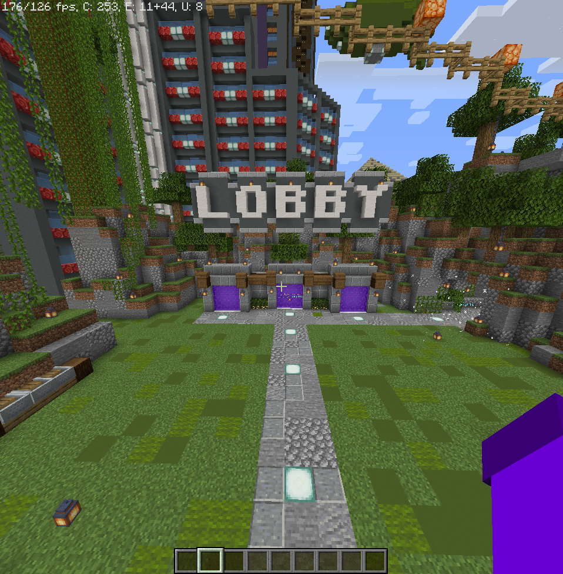

先日、アンドロイドスマホを複数台使ってマイクラサーバーを構築したときのメモです。[termux](../DB/Software/Software_DATA/termux.md)のリポから適切なJavaを導入することができなかったり、マニュアルインストールで問題があったりしたのでまとめました。

## 環境

家にあったスマホで構築しました。この記事では、[PaperMC](../DB/Software/Software_DATA/PaperMC.md)で構築します。

SnapDragon 600番台や700番台の発熱しずらいSoCを使っているスマホで構築するのがおすすめです。

<table class="has-fixed-layout" style="border-width:1px"><tbody><tr><td>機種</td><td>OPPO A5 2020</td></tr><tr><td>OS</td><td>ColorOS 7.1(Android 10)</td></tr><tr><td>SoC</td><td>SnapDragon 655</td></tr><tr><td>Termux</td><td>0.118.0</td></tr><tr><td>サーバー</td><td>PaperMC</td></tr></tbody></table>

## インストール

素の[[Termux]]環境では[[PaperMC]]の実行で必要なJava 16が動作しないので、[proot-distro](../DB/Software/Software_DATA/proot-distro.md)を用いて、debianの環境を作ります。下のコマンドを[[termux]]で実行することでインストールできます！

```
apt update -y && apt install -y proot-distro
```

インストールが終わったら、[[proot-distro]]から[[debian]]をインストールします。イメージをダウンロードするため、環境によっては時間がかかるかもしれません。

```
proot-distro install debian
```

prootな[[debian]]がインストールできたら、今度はその[[debian]]環境にログインします。

```
proot-distro login debian
```

ちなみに、debian環境から抜けるにはexitコマンドを使うことでログアウトできます。

**\==== ここからproot debian環境 ====**

### JDK16 のインストール

他バージョンのOpenJDKは[ここ](https://jdk.java.net/archive/)で見つかります。  
[wget](../DB/Software/Software_DATA/wget.md) コマンドで`openjdk-16.0.2\_linux-aarch64\_bin.tar.gz`をホームディレクトリにダウンロードし、tarコマンドで解凍

```
wget https://download.java.net/java/GA/jdk16.0.2/d4a915d82b4c4fbb9bde534da945d746/7/GPL/openjdk-16.0.2_linux-aarch64_bin.tar.gz
tar -zxvf openjdk-16.0.2_linux-aarch64_bin.tar.gz
```

うまくいってたら、~/jdk-16.0.2ディレクトリができていると思います。

これでJDK16が使える状態になりました！

### マイクラサーバーのインストール

https://papermc.io/downloads/all

上のサイトから使いたい[[PaperMC]]のサーバーを任意のフォルダにダウンロード。

ダウンロードしてきたら、同じディレクトリにstart.shという起動スクリプトを作成して、そこに以下の内容をコピーします。

```
~/jdk-16.0.2/bin/java -Xmx1G -Xms1G -jar paper-1.16.5-794.jar
```

あとは、start.shスクリプトを実行することで、サーバーが起動します。
