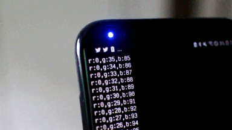

Galaxyのスマートフォンでインジケーターを虹色に光らせるだけのプログラム。
# 必要条件
- **Root化**
- **Termux**の導入
# サポート端末
他のGalaxy端末ではテストしていませんが、動くかもしれません。
- Galaxy S8+ \[Snapdragon\]
# 配布先・インストール方法
https://github.com/zozonteq/galaxy-rainbow-LED-indicator
# 技術仕様
## インジケータを任意の色に書き換える
```shell
#!/bin/sh
echo $1 > /sys/class/leds/led_r/brightness
echo $2 > /sys/class/leds/led_g/brightness
echo $3 > /sys/class/leds/led_b/brightness
```
このように`/sys/class/leds/led_?/brightness`の値を書き換えることで**任意の色**に書き換えることができます。